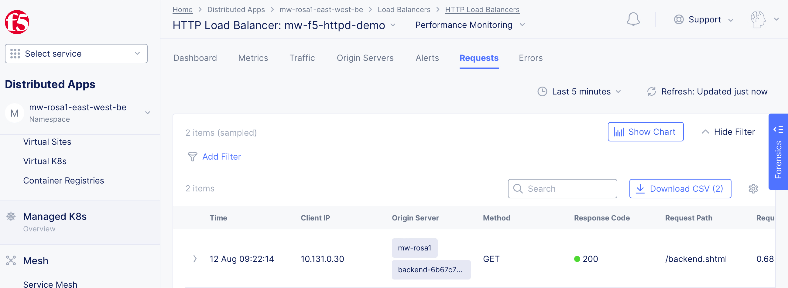

## East-west LB Example

Deploy f5-demo-httpd on the cluster and use it as backend for another deployment of f5-demo-httpd
in another namespace, accessed via F5 XC LB/origin pool, then publish the service using ROSA
ingress operator to the Internet.

```
               +------------------------------------------------+
               |             ROSA Cluster rosa1                 |
               |                                                |
Internet  ---  | frontend ---- CE LB --- Origin ---- backend    |
               | east-west   cluster-east-west-be  east-west-be |
               +------------------------------------------------+
```

The frontend service will be published at 

https://f5-demo-httpd-<prefix>-east-west.apps.<prefix>-<cluster_name>.*.p1.openshiftapps.com

To reach backend service use

https://f5-demo-httpd-<prefix>-east-west.apps.<prefix>-<cluster_name>.*.p1.openshiftapps.com/backend/

This will generate a logged request in F5 XC:



(Script [validate.sh](./validate.sh) extracts the actual URL and uses it for validation)

To deploy, copy [terraform.tfvars.example](terraform.tfvars.example) to terraform.tfvars and
set the F5 XC API and Token credentials. 


Then do the usual:

```
terraform init
terraform plan
terraform apply
```

Validate the published service via

```
$ ./validate.sh

frontend services on namespace mw-east-west:
NAME            TYPE        CLUSTER-IP      EXTERNAL-IP   PORT(S)    AGE
f5-demo-httpd   ClusterIP   172.30.73.197   <none>        8080/TCP   84m

services provided by F5XC LB on namespace mw-rosa1-east-west-be:
NAME      TYPE       CLUSTER-IP       EXTERNAL-IP   PORT(S)        AGE
backend   NodePort   172.30.122.135   <none>        80:32668/TCP   84m

backend services on namespace mw-east-west-be:
NAME      TYPE        CLUSTER-IP       EXTERNAL-IP   PORT(S)    AGE
backend   ClusterIP   172.30.235.136   <none>        8080/TCP   84m
curl https://f5-demo-httpd-mw-east-west.apps.mw-rosa1.s6op.p1.openshiftapps.com/txt ...

================================================
 ___ ___   ___                    _
| __| __| |   \ ___ _ __  ___    /_\  _ __ _ __
| _||__ \ | |) / -_) '  \/ _ \  / _ \| '_ \ '_ \
|_| |___/ |___/\___|_|_|_\___/ /_/ \_\ .__/ .__/
                                     |_|  |_|
================================================

      Node Name: mw-rosa1
     Short Name: f5-demo-httpd-6c77f6b7d5-ck5hr

      Server IP: 10.131.0.30
    Server Port: 80

      Client IP: 10.128.4.14
    Client Port: 47340

Client Protocol: HTTP
 Request Method: GET
    Request URI: /txt

    host_header: f5-demo-httpd-mw-east-west.apps.mw-rosa1.s6op.p1.openshiftapps.com
     user-agent: curl/8.1.2
x-forwarded-for: 212.51.142.52


checking backend connection via CE LB ...
curl https://f5-demo-httpd-mw-east-west.apps.mw-rosa1.s6op.p1.openshiftapps.com/backend/ ...
<!DOCTYPE html><html><head><title>Demo App</title><link rel="stylesheet" href="/stylesheets/style.css"></head>
<body>
  <h1>Backend App</h1><p>Welcome to Demo App</p>
  <p>This is a very basic demo of a Backend Application that should only be accessible from a Frontend Application.</p>
  <p>Note that on this page that the Client IP and User-Agent will differ from the Frontend Application.</p>
  <ul>
  <li><a href="/">Frontend App</a></li>
  </ul>

<p><b>Server IP</b> = 10.128.2.19</p>

<p><b>Client IP</b> = 10.129.2.14</p>

<p><b>Request Headers</b> =</p>
<div class="indent"><p>host: backend.mw-east-west-be</p>

<p>user-agent: Frontend App/1.0</p>


<p>x-forwarded-for: 212.51.142.52, 10.130.2.23,10.128.2.20</p>

<pre>
<!#--#printenv -->
	       </pre>
</body></html>
```
 
## Resources

- [How to deploy a web service on OpenShift](https://www.redhat.com/sysadmin/deploy-web-service-openshift)
- [https://github.com/f5devcentral/f5-demo-httpd](https://github.com/f5devcentral/f5-demo-httpd)
